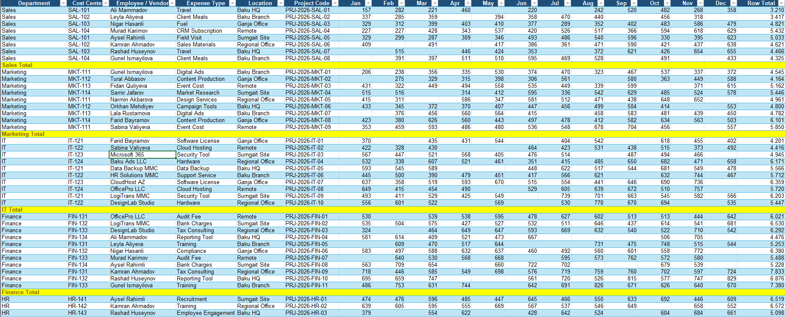
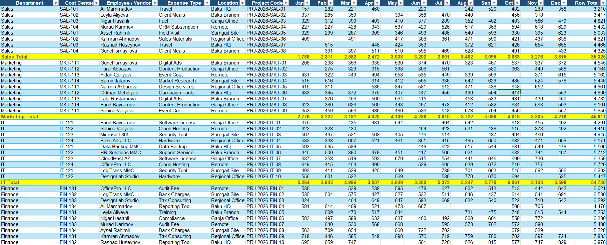

# Excel VBA Subtotal Automation

## Project Overview

This project demonstrates an Excel VBA automation solution for calculating dynamic subtotals in a department-based expense report.

The VBA macro automatically detects yellow-highlighted subtotal rows and calculates column-wise totals dynamically, even when:
- new rows are added
- new columns are added
- some cells contain blank values

---

## Business Problem

Manual subtotal calculations in Excel reports are time-consuming and error-prone. When datasets grow or change structure, fixed formulas often break and require manual updates.

---

## Solution

I developed a dynamic VBA macro that:

- Detects the last used row automatically
- Detects the last used column automatically
- Identifies yellow-highlighted subtotal rows
- Calculates totals dynamically for each department block
- Handles blank cells correctly
- Works with changing dataset structures

---

## Technologies Used

- Microsoft Excel
- VBA (Visual Basic for Applications)
- Dynamic Range Detection
- Conditional Logic
- Loops
- Offset
- Worksheet Functions

---

## VBA Concepts Applied

- `Worksheet`
- `Cells`
- `Range`
- `Find`
- `Offset`
- `For Loop`
- `If Statements`
- `WorksheetFunction.Sum`
- `WorksheetFunction.Count`

---

## Screenshots

### Before Automation

### After Automation

---

## Result

The automation significantly reduces manual reporting work and improves scalability and accuracy in Excel-based financial and operational reports.
